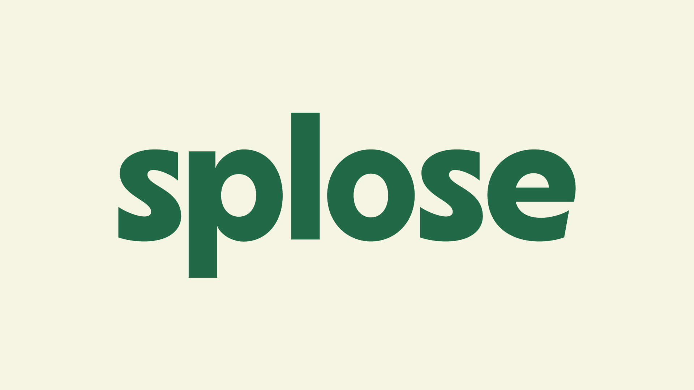

# Internship at [splose](https://www.splose.com)

## Overview

splose is an AI practice management platform serving the Allied Health sector. This internship focused on transforming how patients interact with the booking system. For practice, it means moving away from a manual, admin-mediated scheduling model toward an automated, patient-centric self-service experience.

## Project Charter

**Goal:** Empower patients within the Allied Health sector to manage their own bookings independently.

**Problem:** Scheduling was handled manually by administrative staff, creating friction for both patients and clinics which causing delays, higher admin overhead, and a passive patient experience.

**Solution:** Build an automated self-service booking system that puts scheduling control directly in the hands of patients, reducing dependency on admin intervention and streamlining the end-to-end appointment workflow.

**Impact:**

- Reduces administrative workload by ~2 hours per admin per week
- Improves revenue leakage by minimising missed or unconfirmed bookings
- Enhances patient experience through digital convenience and self-service accessibility

---

## Links

[Charter Presentation](https://docs.google.com/presentation/d/1-S7wkunQiJNWGYChYazYPjBCD8GshpF0LjYH8V2K_ho/edit?usp=sharing)

[Final Presentation](https://docs.google.com/presentation/d/1lnvjGImb3n1lDhhX6I6v_h9n1KFORM8IDQpRV2jI_HA/edit?usp=sharing)
